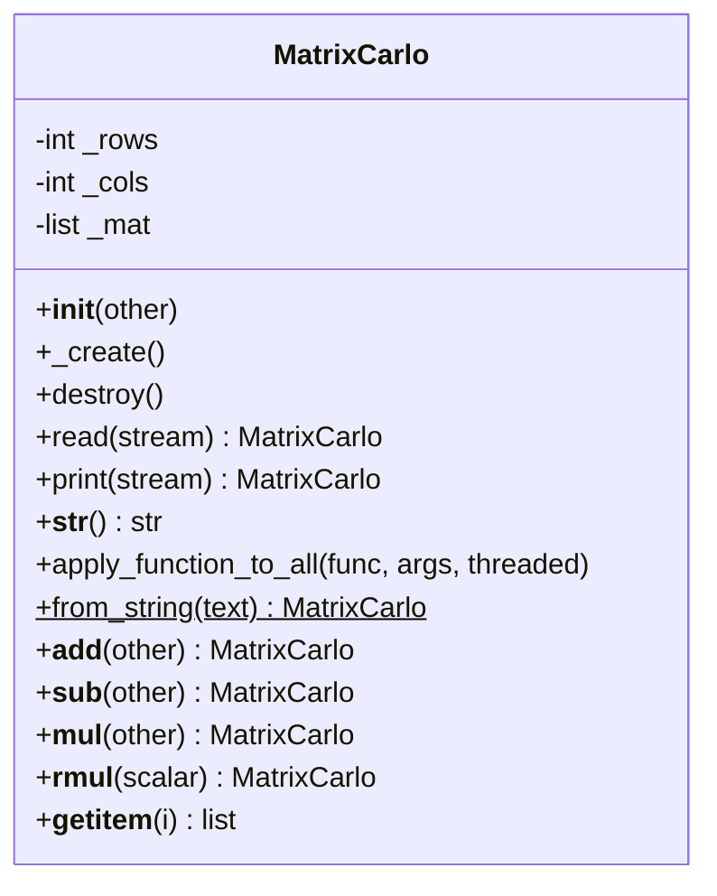

# 4 Castro Galindo Carlo André — Tarea: Clase Matrix en Python

## Tareas completadas en carlo_matrix.py y carlo.py

* Implementacion de `__init__` como constructor default y copy constructor (copia profunda fila por fila).
* Implementacion de `_create` / `destroy` equivalentes a `Create()` / `Destroy()` de C++ con manejo de memoria via GC.
* Implementacion de `read(stream)` y `print(stream)` para I/O desde stdin, stdout o archivo, equivalente a `operator>>` / `operator<<`.
* Implementacion de `apply_function_to_all(func, *args)` con variadic args, equivalente al template `ApplyFunctionToAll(Func, Args&&...)` de C++.
* Implementacion de `apply_function_to_all(..., threaded=True)` usando `threading.Thread`, un hilo por fila.
* Implementacion de `from_string("NxM: n1 n2 ... / fila2 ...")` con expresiones regulares (`re.search`, `re.findall`) para parsear matrices desde texto.
* Implementacion de `__add__` y `__sub__` para suma y resta elemento a elemento, equivalentes a `operator+` / `operator-`.
* Implementacion de `__mul__` para multiplicacion matricial (`Matrix * Matrix`) y por escalar (`Matrix * valor`).
* Implementacion de `__rmul__` para multiplicacion escalar a la izquierda (`valor * Matrix`), equivalente a la funcion libre `operator*` de C++.
* Implementacion de `__getitem__` para indexado `m[i][j]`, equivalente a `m_pMat[i][j]` en C++.
* Documentacion completa en formato Google-style docstrings en cada metodo de `carlo_matrix.py`.
* Demo 1: leer matriz con regex, aplicar `add_one` y `square`, guardar en archivo.
* Demo 2: leer desde archivo, aplicar `add_x(5, 10)`, guardar en archivo.
* Demo 3: `m1 = 5*m2 + m3*m4` combinando operadores escalares y matriciales.
* Demo 4: `m1 = m2 * m3`, luego modificar con `m1[0][0] = 8`.
* Demo Threads: aplicar `square` con `threaded=True` (un hilo por fila).

## Diagrama de la clase



## Ejecucion

```bash
python3 carlo.py
```

## Archivos creados

* `carlo_matrix.py` — Clase `MatrixCarlo` equivalente Python de `carlo_matrix.h`
* `carlo.py` — Demos equivalentes a `carlo.cpp`
